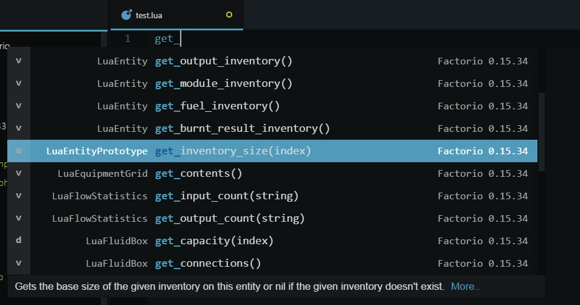

# atom-autocomplete-factorio
[](https://david-dm.org/atom/language-todo)

An autocomplete for Factorios LUA-API.
Docs can be found online at http://lua-api.factorio.com/latest/index.html.
Or under docs-html in your local Factorio installation.



### Updates
* Rewrote from scratch and switched from coffee to js
* Removed Snippets
* automatically (de)activates when editing LUA-files
* Fixed autogeneration Scripts

### Known Issues
* Due to Factorios incoherent html files it is not always possible
  to get everything at it's place
* Toggle doesn't work atm
* When the Devs update their Docs then expect the autogen Script to fail

### ToDo
* rewrite autogeneration scripts
 :- use only one language - Done
 :- a better method to get the type - testing
 :- implement the posibility to use the local Documentation as source

###
Factorio Lua API autocomplete for Atom.
Factorio version in this Package is 0.15.34. To create one for your version please scoll down.

[Forum topic - Autocomplete for Atom](https://forums.factorio.com/viewtopic.php?f=135&t=31456&sid=f324b0d762343de5332f9a132fc5aa08)

### How to create Suggestions for another Version?

You need PHP 5.x, so get that first
I didn't test it with PHP7 so expect the script to fail. There is an option to enable debug mode.
To enable this, open up the settings.inc.php file and set DEBUG = true
This will download both HTML files, converts them, creates the json file and saves everything under
:- ./autogen/builtins.xml
:- ./autogen/classes.xml
:- ./autogen/test.json

+ Download and install PHP5+.
+ Get this Repository.
+ Now your downloaded Repo.
+ Start a Shell and navigate to ```.atom/packages/autocomplete-lua-factorio/autogen/```.
+ In your shell, type <code>php start.php</code>.
+ You can do some configurations in ```settings.inc.php```.
+ Wait.
+ Restart Atom or press [CTRL]+[SHIFT]+[F5] to reload.
