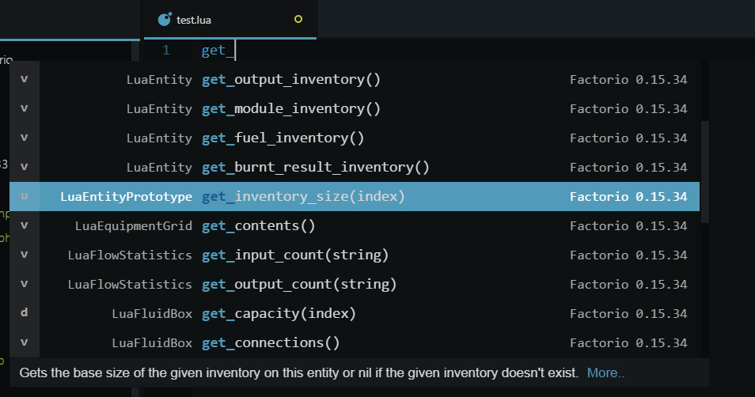

# Factorio's Lua API autocompletition for Atom.

An autocomplete for Factorios LUA-API.<br />
Their Documentation can be found [HERE](http://lua-api.factorio.com/latest/index.html) or under <i>/docs-html</i> in your local Factorio installation.



The Factorio version in this Package is 0.15.34. To create one for your version please read the [HowTo](#How to create Suggestions for another Version?) below.

If you want to contribute please read the [contribution File](.github/CONTRIBUTING.md).

## Updates
* Rewrote from scratch and switched from coffee to js
* Removed Snippets
* automatically (de)activates when editing LUA-files
* Fixed autogeneration Scripts

## Known Issues
* Due to Factorios incoherent html files it is not always possible to get everything at it's place
* Toggle doesn't work atm
* When the Devs update their Docs then expect the autogen Script to fail

## ToDo
* [x] rewrite autogeneration Scripts
* [x] use only one Language in autogeneration Script
* [ ] testing new way to get the Type
* [ ] a better Solution for Braces
* [ ] implement the posibility to use the local Documentation as source

[Forum topic - Autocomplete for Atom](https://forums.factorio.com/viewtopic.php?f=135&t=31456&sid=f324b0d762343de5332f9a132fc5aa08)

## How to create Suggestions for another Version?

You need PHP 5.x, so get that first (see below).
I didn't test it with PHP7 so expect the script to fail. There is an option to enable debug mode.
To enable this, open up the settings.inc.php file and set DEBUG = true
This will download both HTML files, converts them, creates the json file and saves everything under
</br><div style="margin-left: auto; margin-right: auto; width: 22em">
./autogen/builtins.xml </br>
./autogen/classes.xml </br>
./autogen/test.json
</div>

+ Get this Repository (here or via Atom's Package Manager).
+ Download and install [PHP5+](http://php.net/downloads.php).
+ Start a Shell and navigate to ```.atom/packages/autocomplete-lua-factorio/autogen/```.
+ Start a shell and type <code>php start.php</code>.
+ You can do some configurations in ```settings.inc.php```.
+ Wait.
+ Restart Atom or press [CTRL]+[SHIFT]+[F5] to reload.

## How to contribute?

[Please read the CONTRIBUTING.md File](.github/CONTRIBUTING.md).
